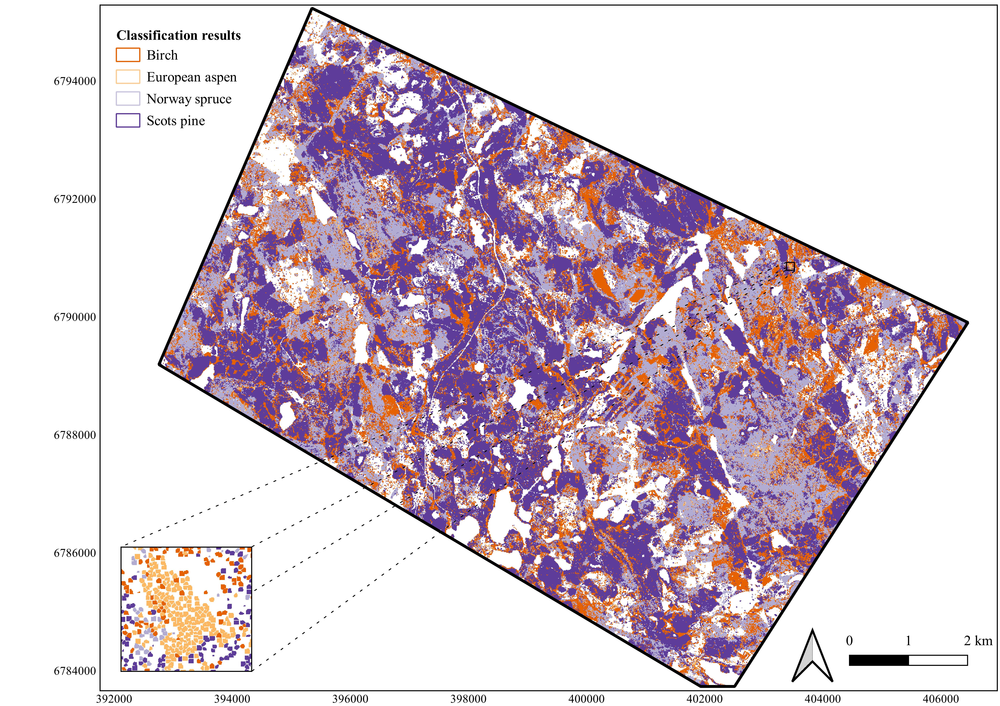

# Tree species classification from from airborne LiDAR and hyperspectral data using 3D convolutional neural networks

## Table of Contents

* [About](#about)
* [Getting started](#about)
  * [Installation](#installation)
* [Data](#data)
* [Workflow](#workflow)
  * [Preprocessing](#preprocessing)
  * [Individual tree detection and matching field data to detected tree crowns](#individual-tree-detection-and-matching-field-data-to-detected-tree-crowns)
  * [Training and validation data generation](#training-and-validation-data-generation)
  * [Model training](#model-training)
    * [Reference methods](#reference-methods)
    * [3D CNNs](#3d-cnns)
  * [Inference and interpretation](#inference-and-interpretation)
* [Authors](#authors)

## About

This is a code repository for our paper **Tree species classification from airborne hyperspectral and LiDAR data using 3D convolutional neural networks**, submitted to Remote Sensing of Environment for publication.

> During the last two decades, forest monitoring and inventory systems have moved from field surveys to remote sensing-based methods. These methods tend to focus on economically significant components of forests, thus leaving out many factors vital for forest biodiversity, such as the occurrence of species with low economical but high ecological values. Airborne hyperspectral imagery has shown significant potential for tree species classification. However, the most common analysis methods, such as random forest and support vector machines, require manual feature engineering in order to utilize both spatial and spectral features, whereas CNNs are able to extract these features from the raw data. 
>
> We compared the performance of three-dimensional convolutional neural networks (3D-CNNs) with different sized square image patches centered around a treetop against support vector machine, random forest, gradient boosting machine and artificial neural network in individual tree species classification from hyperspectral data with high spatial and spectral resolution. We collected hyperspectral and LiDAR data along with extensive ground reference data measurements of tree species from the 83 km² study area located in the southern boreal zone in Finland. A LiDAR-derived canopy height model was used to match ground reference data to aerial imagery. Our research focused on classification of major tree species, Scots pine (*Picea abies* (L.) Karst.), Norway spruce (*Pinus sylvestris*), birch (*Betula* sp., including both *pendula* and *pubescens*), together with a keystone species European aspen (*Populus tremula* L.) that has a sparse and scattered occurrence in boreal forests. The best performing 3D-CNN utilizing 4 m image patches was able to achieve macro F1-score of 0.86 and overall accuracy of 87 %, and the lowest performing 3D-CNN utilizing 10 m image patches achieved OA of 85 % and F1-score of 0.83, compared to OA of 82.4 % and F1-score of 0.82 for support-vector machine and OA of 81.7 % and F1-score of 0.82 for artificial neural network. Compared to the reference models, 3D-CNNs were more efficient in distinguishing coniferous species from each other, with a concurrent high accuracy for aspen classification. 
>
> Deep neural networks, being a black-box model, hide the information about how they reason their decision. We used both occlusion and saliency maps to gain insight on which input features 3D-CNN puts the most weight. Finally, we used the best-performing 3D-CNN to produce wall-to-wall tree species map for the full study area that can later be used as a ground-truth in other tasks, such as tree species mapping from multispectral satellite images. Improved tree species classification demonstrated by our study can benefit both sustainable forestry and biodiversity conservation.


*Main tree species aggregated to 10 m grid. Each grid cell is labeled with the most common tree species based on the number of treetops. Smaller figure shows a 100m X 100m patch with a larger aspen stand*

## Getting started

Project members can access preinstalled conda environment by running `source conda_activate.sh`. This version has fastai2 v0.0.17 and pytorch 1.3.0. This project should work with latest versions (at the time of writing `fastai2==0.0.25` and `pytorch=1.6.0`, but this hasn't been tested yet.

Do not use any CSC modules with this conda environment when running python based scripts and notebooks. 

For R-files, use `module load r-env`

### Installation

fastai2 was officially released and renamed to fastai 21.8.2020. The work was done with prerelease version, but it *should* work with the version available on pip and conda by running 

```bash
shopt -s globstar
perl -pi -e 's/fastai2/fastai/g' **/*
```

Then run `conda env create -f environment.yml` and `pip install fastai`. 

Steps below show how to replicate development environment.

Run `conda env create -f environment.yml`, and then use editable install of fastai2 and fastcore:

```bash
git clone https://github.com/fastai/fastcore
cd fastcore
pip install -e ".[dev]"

cd ..
git clone --recurse-submodules https://github.com/fastai/fastai2
cd fastai2
pip install -e ".[dev]"
```
NOTE: Since Pytorch version 1.6, the default save format has changed from Pickle-based to zip-file based. `torch.load` should however work with older versions. 

## Data

Unfortunately, data is not (yet) publically available. Further questions can be sent to authors.

## Workflow

All steps in our work are presented either in Jupyter Notebooks or individual scripts

### Preprocessing

Preprocessing is described in notebook [Data exploration and preprocessing](notebooks/Data%20exploration%20and%20preprocessing.ipynb).

### Individual tree detection and matching field data to detected tree crowns

Process and steps is described in notebook [Individual tree detection, segmentation and matching to field data](notebooks/Individual%20tree%20detection%2C%20segmentation%20and%20matching%20to%20field%20data.ipynb).

### Training and validation data generation

Process is descried in notebook [Training and validation data generation](notebooks/Training%20and%20validation%20data%20generation.ipynb).

### Model training

#### Reference methods

Training and validation process is presented in notebook [Comparison methods](notebooks/Comparison%20methods.ipynb).

#### 3D CNNs

Example of training process is presented in notebook [Tree species classification with fastai-v2](Tree%20species%20classification%20with%20fastai-v2.ipynb)

### Inference and interpretation

Inferences and comparisons between different CNN-models are presented in notebook [Full tile predictions](Full%20tile%20predictions.ipynb)

Interpretation based on saliency and occlusion is presented in notebook [Saliences](Saliences.ipynb)

## Authors

Janne Mäyrä (corresponding author), Sarita Keski-Saari, Sonja Kivinen, Topi Tanhuanpää, Pekka Hurskainen, Peter Kullberg, Laura Poikolainen, Arto Viinikka, Sakari Tuominen, Timo Kumpula, Petteri Vihervaara
